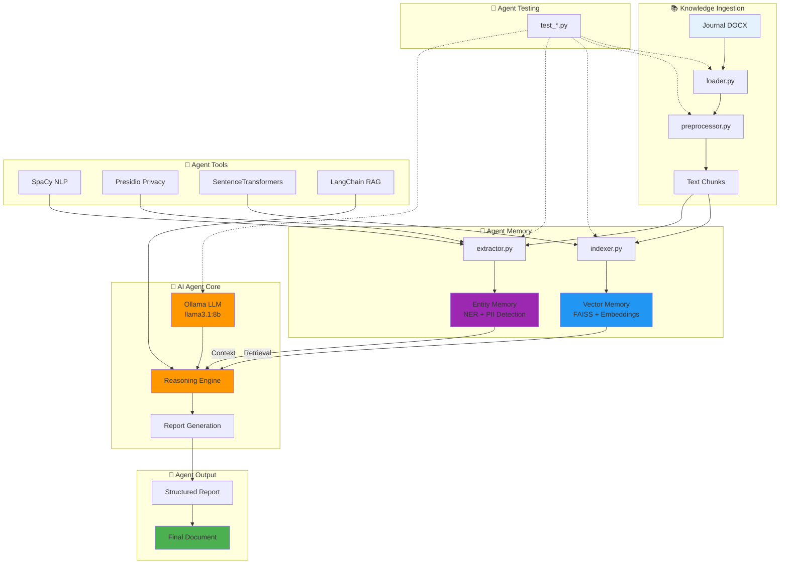

# Agent de rédaction autonome

## To-do list

### Phase 0 – Initialisation et infrastructure
1. **Configurer l’environnement local** – ✔️
2. **Tester Llama 3.1 Q8 via Ollama** – ✔️
3. **Structurer dépôt Git & CI légère** – ✔️

### Phase 1 – Ingestion et indexation
4. **Module d’ingestion DOCX** – ✔️
5. **Prétraitement et segmentation** – ✔️
6. **Indexation vectorielle (FAISS)** – ✔️

### Phase 2 – Extraction & planification
7. **Pipeline NLP extraction & anonymisation** – ✔️
8. **Résumé itératif & raffinement** – ◻️
9. **Génération de l’ossature (plan)** – ◻️

### Phase 3 – Rédaction & feedback
10. **Rédaction section par section** – ◻️
11. **Interface de feedback minimal** – ◻️
12. **Tests d’intégration et évaluation** – ◻️

## Progrès actuel

- Modules `loader.py`, `preprocessor.py`, `indexer.py`, `extractor.py` implémentés et testés.
- Environnement local configuré (Python, venv, Git, pre-commit).
- Modèle Llama 3.1 Q8 opérationnel via Ollama.
- Data ingestion, nettoyage, segmentation, indexation RAG et extraction d’entités fonctionnels.

## Étapes suivantes

1. Implémenter la **Résumé itératif & raffinement** via LangChain RefineChain.
2. Générer automatiquement l’**ossature du rapport** (plan détaillé).
3. Développer la **rédaction progressive** des sections.
4. Mettre en place l’**interface de feedback** (CLI/notebook ou web).
5. Réaliser les **tests d’intégration** et ajuster les prompts.
6. (Optionnel) Ajouter UI web (Streamlit / FastAPI + React).
7. Documenter le pipeline et préparer la soutenance.

