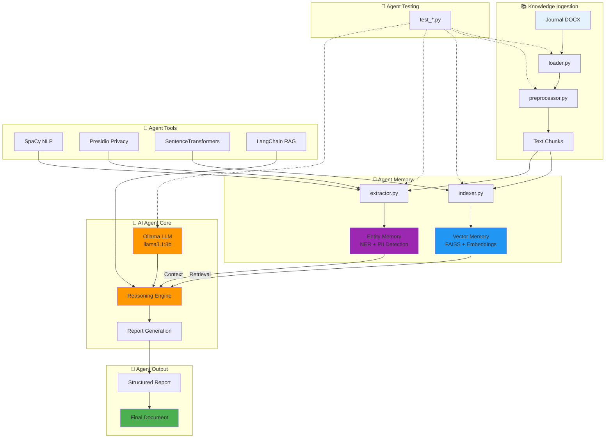

# Agent de rédaction autonome

## To-do list

### Phase 0 – Initialisation et infrastructure
1. **Configurer l’environnement local** – ✔️
2. **Tester Llama 3.1 Q8 via Ollama** – ✔️
3. **Structurer dépôt Git & CI légère** – ✔️

### Phase 1 – Ingestion et indexation
4. **Module d’ingestion DOCX** – ✔️
5. **Prétraitement et segmentation** – ✔️
6. **Indexation vectorielle (FAISS)** – ✔️

### Phase 2 – Extraction & planification
7. **Pipeline NLP extraction & anonymisation** – ✔️
8. **Résumé itératif & raffinement** – ◻️
9. **Génération de l’ossature (plan)** – ◻️

### Phase 3 – Rédaction & feedback
10. **Rédaction section par section** – ◻️
11. **Interface de feedback minimal** – ◻️
12. **Tests d’intégration et évaluation** – ◻️

## Progrès actuel

- Modules `loader.py`, `preprocessor.py`, `indexer.py`, `extractor.py` implémentés et testés.
- Environnement local configuré (Python, venv, Git, pre-commit).
- Modèle Llama 3.1 Q8 opérationnel via Ollama.
- Data ingestion, nettoyage, segmentation, indexation RAG et extraction d’entités fonctionnels.

## Étapes suivantes

1. Implémenter la **Résumé itératif & raffinement** via LangChain RefineChain.
2. Générer automatiquement l’**ossature du rapport** (plan détaillé).
3. Développer la **rédaction progressive** des sections.
4. Mettre en place l’**interface de feedback** (CLI/notebook ou web).
5. Réaliser les **tests d’intégration** et ajuster les prompts.
6. (Optionnel) Ajouter UI web (Streamlit / FastAPI + React).
7. Documenter le pipeline et préparer la soutenance.


### Structure Détaillée du Projet

```
agent-redaction-autonome/
├── .flake8                           # Configuration linting Python
├── .gitignore                        # Fichiers à ignorer par Git
├── .pre-commit-config.yaml          # Hooks de pré-commit (Black, Flake8)
├── README.md                         # Documentation principale du projet
├── requirements.txt                  # Dépendances Python
│
├── src/                             # Code source principal
│   ├── __init__.py                  # Package Python
│   ├── loader.py                    # Module d'ingestion des documents DOCX
│   ├── preprocessor.py              # Prétraitement et segmentation de texte
│   ├── indexer.py                   # Indexation vectorielle avec FAISS
│   ├── extractor.py                 # Extraction d'entités et anonymisation PII
│   │
│   ├── test_extractor.py           # Tests pour le module d'extraction
│   ├── test_indexer.py             # Tests pour l'indexation vectorielle
│   ├── test_ollama.py              # Test de connexion avec Ollama
│   └── test_preprocessor.py        # Tests pour le prétraitement
│
├── data/                           # Données d'entrée
│   └── journal/                    # Fichiers DOCX du journal (*.docx)
│       ├── YYYY-MM-DD_*.docx      # Format de fichiers attendu
│       └── ...
│
├── db/                             # Base de données vectorielle
│   └── chroma/                     # Stockage FAISS/ChromaDB
│
├── venv/                           # Environnement virtuel Python
│
├── models/                         # Modèles et configurations IA
│   └── ollama/                     # Configuration Ollama
│       └── llama3.1:8b-instruct-q8_0  # Modèle LLM principal
│
├── output/                         # Fichiers de sortie générés
│   ├── reports/                    # Rapports générés
│   ├── summaries/                  # Résumés produits
│   └── plans/                      # Ossatures/plans générés
│
├── config/                         # Fichiers de configuration
│   ├── prompts/                    # Templates de prompts
│   │   ├── extraction.yaml         # Prompts pour l'extraction
│   │   ├── summarization.yaml      # Prompts pour la résumé
│   │   └── generation.yaml         # Prompts pour la génération
│   └── settings.yaml               # Configuration générale
│
├── pipeline/                       # Pipeline de traitement
│   ├── __init__.py
│   ├── ingestion.py               # Orchestration ingestion
│   ├── processing.py              # Orchestration traitement
│   ├── generation.py              # Orchestration génération
│   └── feedback.py                # Interface de feedback
│
├── utils/                          # Utilitaires
│   ├── __init__.py
│   ├── nlp_utils.py               # Utilitaires NLP
│   ├── file_utils.py              # Utilitaires fichiers
│   └── logging_config.py          # Configuration des logs
│
├── tests/                          # Tests unitaires et d'intégration
│   ├── __init__.py
│   ├── unit/                       # Tests unitaires
│   │   ├── test_loader.py
│   │   ├── test_preprocessor.py
│   │   ├── test_indexer.py
│   │   └── test_extractor.py
│   ├── integration/                # Tests d'intégration
│   │   ├── test_pipeline.py
│   │   └── test_end_to_end.py
│   └── fixtures/                   # Données de test
│       └── sample_journal.docx
│
├── notebooks/                      # Notebooks Jupyter pour prototypage
│   ├── exploration.ipynb          # Exploration des données
│   ├── model_testing.ipynb        # Test des modèles
│   └── evaluation.ipynb           # Évaluation des résultats
│
├── scripts/                        # Scripts d'automatisation
│   ├── setup.py                   # Script d'installation
│   ├── run_pipeline.py            # Exécution complète du pipeline
│   └── evaluate_model.py          # Évaluation du modèle
│
├── docs/                           # Documentation
│   ├── architecture.md            # Architecture du système
│   ├── api_reference.md           # Référence API
│   └── user_guide.md              # Guide utilisateur
│
└── logs/                           # Fichiers de logs
    ├── application.log
    ├── error.log
    └── performance.log
```

### Description des Modules Principaux

#### 📚 **Modules d'Ingestion** (`src/`)
- **`loader.py`** : Chargement des fichiers DOCX avec extraction de dates
- **`preprocessor.py`** : Normalisation, segmentation et chunking du texte
- **`indexer.py`** : Indexation vectorielle avec FAISS et SentenceTransformers
- **`extractor.py`** : Extraction d'entités (spaCy) + détection/anonymisation PII (Presidio)

#### 🤖 **Intelligence Artificielle**
- **Modèle LLM** : Llama 3.1 8B quantifié (Q8) via Ollama
- **Embeddings** : paraphrase-multilingual-MiniLM-L12-v2
- **NLP** : spaCy français (fr_core_news_sm)
- **RAG** : LangChain + FAISS pour la recherche sémantique

#### 🔧 **Pipeline de Traitement**
1. **Ingestion** → Lecture DOCX + extraction dates
2. **Prétraitement** → Normalisation + segmentation
3. **Indexation** → Vectorisation + stockage FAISS
4. **Extraction** → Entités + anonymisation PII
5. **Génération** → Résumés + plans + rédaction (à implémenter)

#### 🧪 **Tests et Validation**
- Tests unitaires pour chaque module
- Tests d'intégration du pipeline complet
- Validation avec données d'exemple

#### 📊 **État d'Avancement**
- ✅ **Phase 1** : Ingestion et indexation (100%)
- ✅ **Phase 2** : Extraction et anonymisation (100%)
- ⏳ **Phase 3** : Résumé itératif et planification (0%)
- ⏳ **Phase 4** : Rédaction et feedback (0%)

### Technologies Utilisées

| Domaine | Technologies |
|---------|-------------|
| **LLM** | Ollama + Llama 3.1 8B |
| **NLP** | spaCy, LangChain, SentenceTransformers |
| **Privacy** | Presidio (Analyzer + Anonymizer) |
| **Vectorization** | FAISS, ChromaDB |
| **Documents** | python-docx |
| **Dev Tools** | Black, Flake8, pre-commit |
